# sway-layout

Per-workspace tiling layouts for [sway](https://swaywm.org): master and
stack, centred master, dwindle, spiral, grid, tabs and a floating
workspace. The layout is chosen per workspace from a menu and remembered.

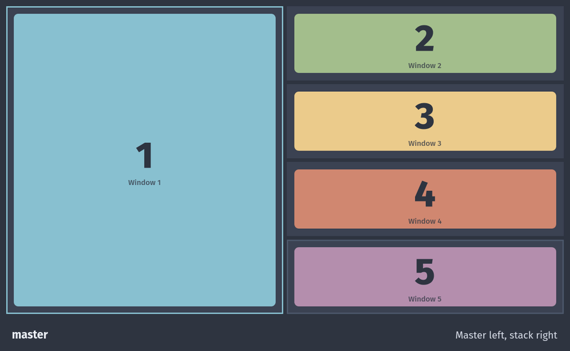

It is a single Python file with no dependencies, driven over sway's IPC
socket. New windows are placed by sway rules the daemon sets up, so they
appear in their final place instead of jumping there.
[ARCHITECTURE.md](ARCHITECTURE.md) explains how it works.

## Why another one

Other sway layout daemons tend to fight the user: they flicker while
rearranging, pull dialogs and scratchpad windows into the layout, undo
tabs set by hand, reset sizes, drop fullscreen windows, or break with a
second monitor. sway-layout is built around the opposite rule: a
workspace is either fully arranged by its layout or left entirely to
you, and anything you do by hand wins. Every case above is covered by
the headless test suite.

## Layouts

Every layout is fed the same list: the windows of the workspace in order,
the first one being the master. Opening a window adds it at the end,
closing one lets the rest move up, and moves and swaps change the order.
The layout turns that list into a tree of sway containers.

<table>
<tr>
<td width="50%" valign="top">
<h3><code>master</code></h3>

<p>The first window, the master, takes the left half. The others stack on the right in the order they opened. A new window joins the bottom of the stack, and when the master closes the top of the stack takes its place.</p>
</td>
<td width="50%" valign="top">
<h3><code>master-right</code></h3>

<p>The same as <code>master</code>, mirrored: the master on the right and the stack on the left.</p>
</td>
</tr>
<tr>
<td width="50%" valign="top">
<h3><code>wide</code></h3>

<p>The master spans the top, and the stack is a row of windows below it. Good for a wide monitor or for reading long lines.</p>
</td>
<td width="50%" valign="top">
<h3><code>centered</code></h3>
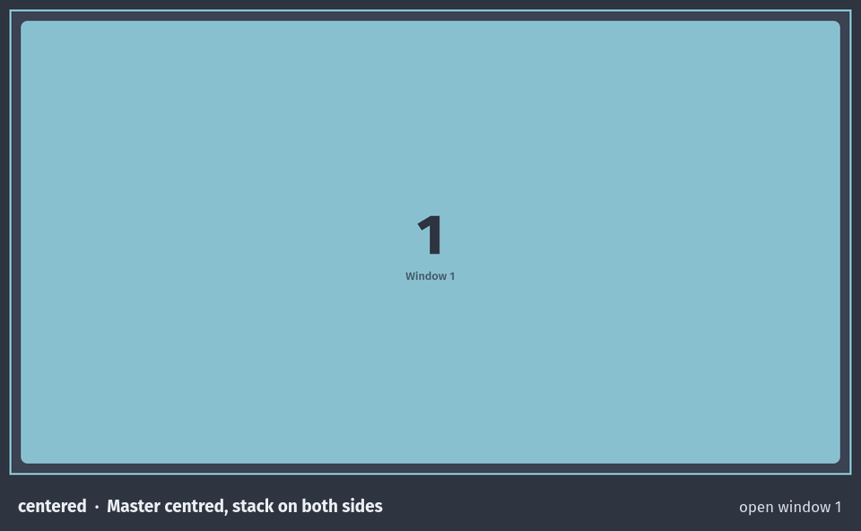
<p>The master sits in the middle, and the stack alternates between the two sides: windows 2 and 4 on the right, 3 and 5 on the left. With two windows it is <code>master</code>.</p>
</td>
</tr>
<tr>
<td width="50%" valign="top">
<h3><code>tabbed-master</code></h3>
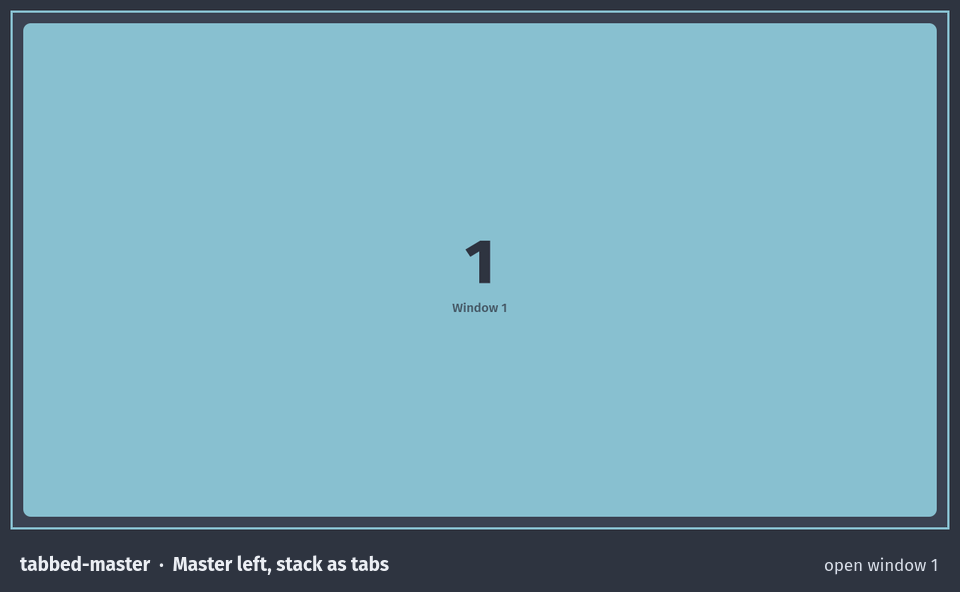
<p>The master on the left, and the stack as tabs on the right, so one stack window is visible at a time at full height. Good for small screens.</p>
</td>
<td width="50%" valign="top">
<h3><code>stacked-master</code></h3>
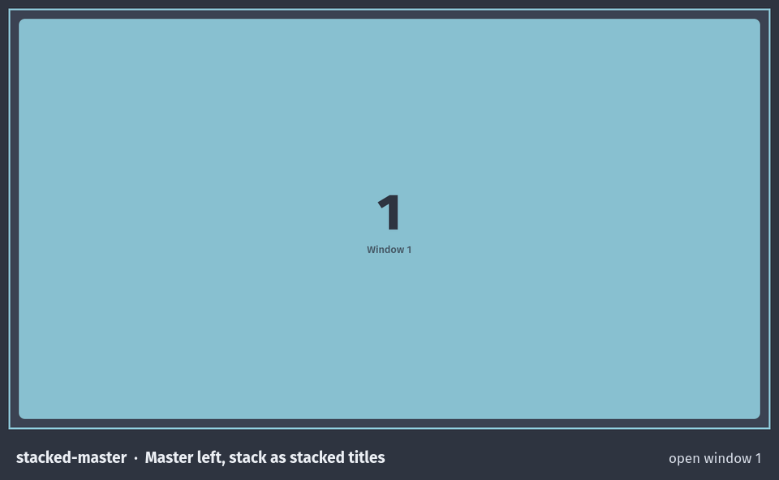
<p>The same as <code>tabbed-master</code>, with the stack as a column of stacked titles.</p>
</td>
</tr>
<tr>
<td width="50%" valign="top">
<h3><code>dwindle</code></h3>
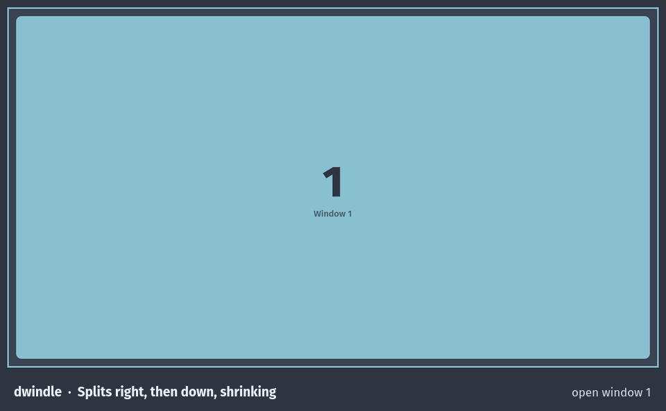
<p>Each window takes half of the space left over, splitting right, then down, then right again, so later windows get smaller.</p>
</td>
<td width="50%" valign="top">
<h3><code>spiral</code></h3>
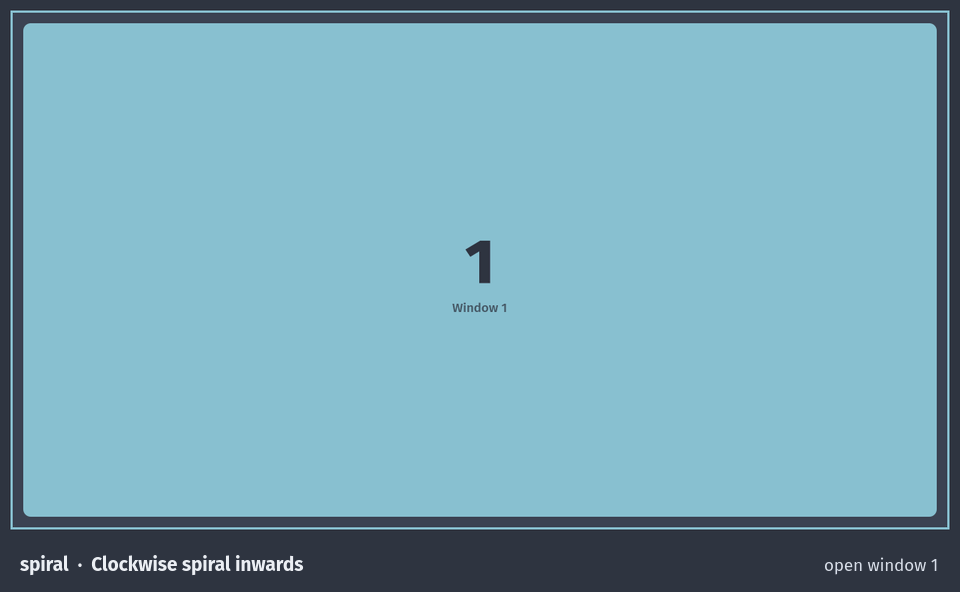
<p>Like <code>dwindle</code>, but the splits turn clockwise (right, down, left, up), so the windows spiral inwards.</p>
</td>
</tr>
<tr>
<td width="50%" valign="top">
<h3><code>grid</code></h3>
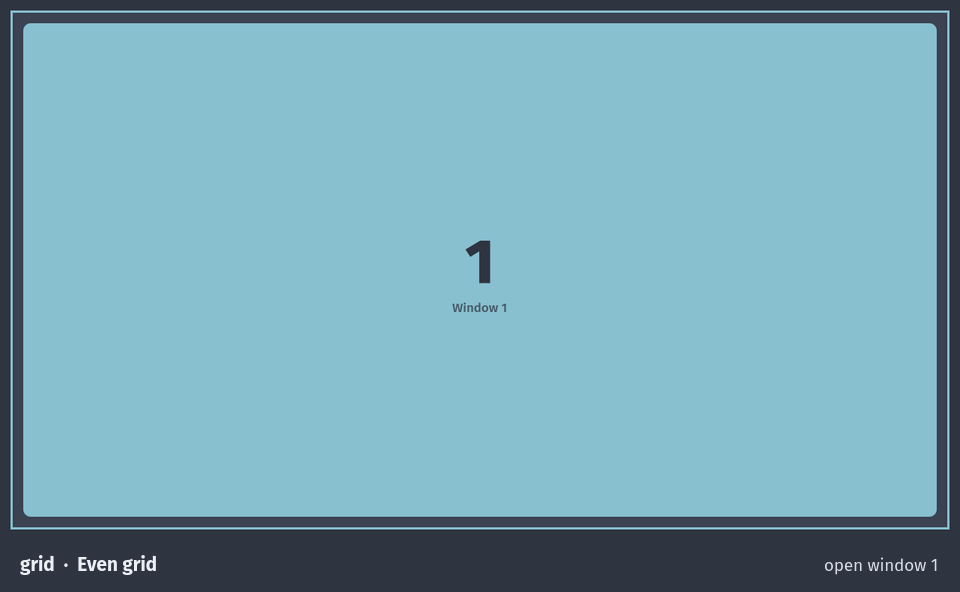
<p>As many columns as the square root of the window count, rounded up, filled row by row. A last row with fewer windows makes them wider.</p>
</td>
<td width="50%" valign="top">
<h3><code>float</code></h3>
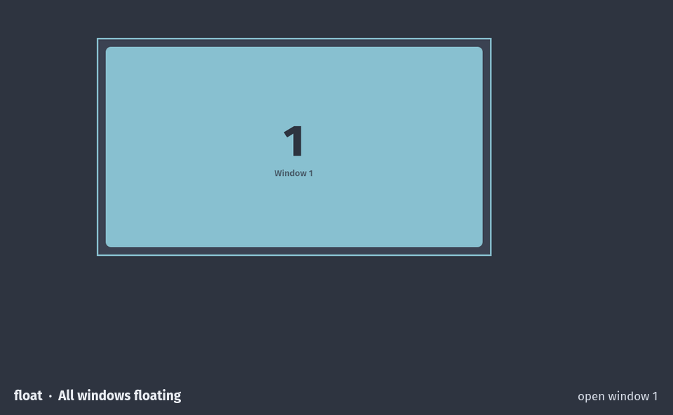
<p>Every window floats at 60% of the output, cascaded around its centre, and a new window never covers another one exactly. Tile a window by hand and it stays tiled.</p>
</td>
</tr>
<tr>
<td width="50%" valign="top">
<h3><code>tabbed</code></h3>
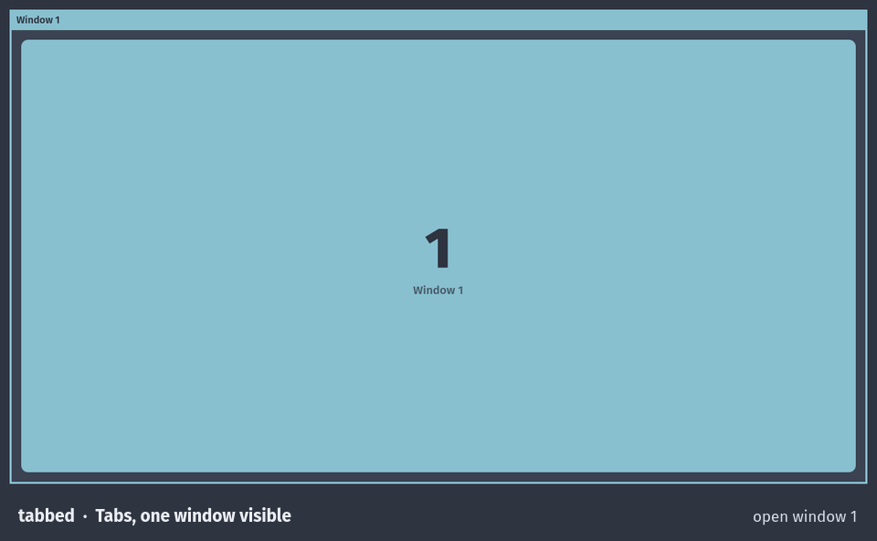
<p>Every window is a tab and one is visible. Moves reorder the tabs.</p>
</td>
<td width="50%" valign="top">
<h3><code>stacking</code></h3>
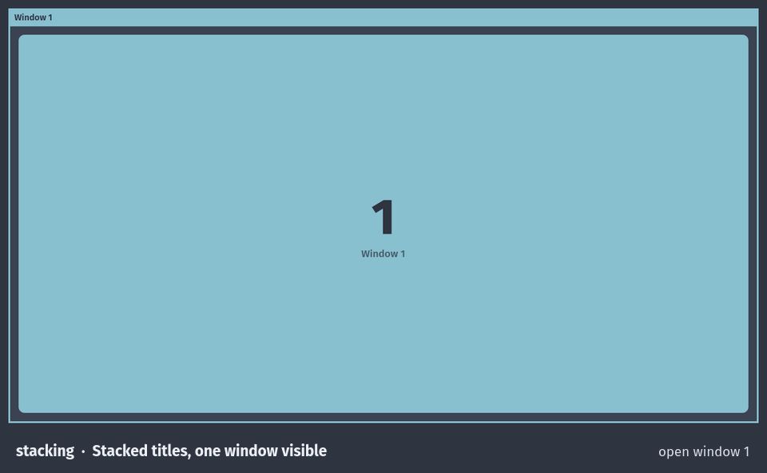
<p>Every window is a stacked title and one is visible. Moves reorder the titles.</p>
</td>
</tr>
</table>

`sway` turns the daemon off for a workspace and leaves it to sway.

## Picking a layout

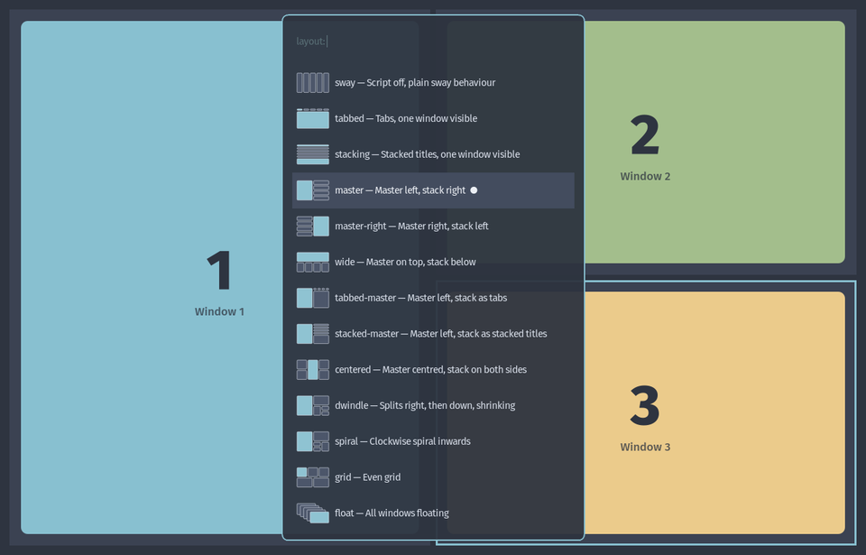

Each workspace has its own layout, remembered across restarts; a new
workspace starts with the last layout picked. The menu marks the current
one, and says when it is paused.

| Key | Action |
| --- | --- |
| `$mod+Shift+t` | Open the layout menu |
| `$mod+m` | Swap the focused window with the master |
| `$mod+Shift+←↓↑→` / `hjkl` | Move the focused window, following the layout |
| `$mod+Shift+1` … `0` | Send the focused window to a workspace |

## What it respects

- **Changes made by hand.** Moving a window, splitting or changing a
  container's layout with sway's own keys, dragging with the mouse or
  running `swaymsg` never gets undone:
  - If the result still fits the layout, the layout keeps going with
    the new order. Dragging a window into the stack, even from another
    output, keeps it where you dropped it.
  - If only a container's style changed and the result is another
    layout, the workspace switches to it. Turning the stack of `master`
    into tabs makes it `tabbed-master`.
  - Otherwise the layout pauses on that workspace and sway places new
    windows as usual. The menu shows the layout as paused. The layout
    comes back by itself once the windows fit it again, or when you pick
    it from the menu.
- **The master size.** Resize the master with the keyboard or the mouse
  and it keeps that size when windows open and close, when the master
  closes and when you switch between layouts.
- **Fullscreen.** A workspace with a fullscreen window is left untouched
  until the window leaves fullscreen.
- **Floating windows.** Dialogs float as usual. A window you float for a
  moment goes back to its place when you tile it again.
  On a `float` workspace it works the other way round: a window you tile
  by hand stays tiled until you float it again or pick `float` from the
  menu.
- **Restarts.** Manual arrangements survive a restart or a crash of the
  daemon.
- **Several outputs.** Workspaces can move between outputs and outputs
  can come and go. Floating windows are fitted to the output they end up
  on.

## Install

1. Install the program and the user service:

   ```sh
   uv tool install git+https://github.com/sertacartun/sway-layout   # or: pipx install .
   mkdir -p ~/.config/systemd/user
   cp contrib/sway-layout.service ~/.config/systemd/user/
   ```

2. Write the sway bindings to a file of their own:

   ```sh
   sway-layout config > ~/.config/sway/sway-layout.conf
   ```

   It starts the daemon and binds `$mod+Shift+t` to the menu, `$mod+m`
   to swap with the master, and `$mod+Shift+` direction keys and numbers
   to moves that follow the layout. Change the keys there if you like.
   It uses `$mod`, as the default sway config defines it.

3. Include it at the end of your sway config and restart sway:

   ```
   include ~/.config/sway/sway-layout.conf
   ```

   Nothing else in your config is changed. The bindings in this file
   replace earlier bindings for the same keys, which sway accepts
   silently.

The menu uses the first of fuzzel, rofi, wofi, tofi, bemenu, wmenu and
dmenu that is installed. fuzzel and rofi also show a picture of each
layout. Any other dmenu-style program works too:
`sway-layout menu --launcher "walker --dmenu"`.

Errors go to the journal: `journalctl --user -u sway-layout`.

## Commands

```sh
sway-layout            # run the daemon
sway-layout menu       # pick a layout for the focused workspace
sway-layout grid       # set a layout for the focused workspace
sway-layout config     # print the sway bindings
```

`nop layout move left|right|up|down` swaps the focused window with its
neighbour in that direction, so the layout always stays whole. Inside
tabs it reorders the tabs first. At the edge of the workspace it moves
the window to the next output. On a workspace without a layout it is
sway's own `move`. `nop layout move number N` sends the window to a
workspace, where it joins the stack or floats, as that workspace's
layout says. `nop layout master` swaps the focused window with the
master; on the master itself it swaps with the top of the stack. Sizes
stay where they are.

## Uninstall

Remove the `include` line from your sway config first, because the
bindings in it do nothing without the daemon. Then:

```sh
systemctl --user disable --now sway-layout.service
rm ~/.config/systemd/user/sway-layout.service ~/.config/sway/sway-layout.conf
uv tool uninstall sway-layout
```

## Files

- `~/.local/state/sway-layout.json`: the layout of every workspace.
- `$XDG_RUNTIME_DIR/sway-layout.*`: the lock, the paused workspaces and
  the last arrangement of the running session.

## Tests

The tests start a headless sway with its own sockets, so they never touch
your session. They need `sway`, `wtype` and GTK 4 for Python
(`python-gobject`), which draws the test windows.

```sh
uv run pytest
```

The animations in this README are recorded the same way, in a headless
sway, with `uv run python docs/record.py`. That also needs `grim`,
ImageMagick and the Fira Sans font.
